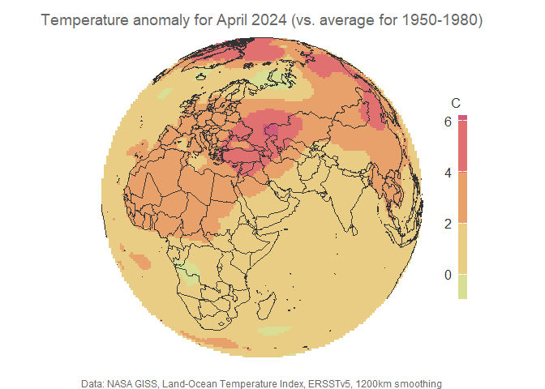

Temperature map of the globe focused on Saudi Arabia
================
Majed N. Turkistani
13/06/2024

### Disclaimer:

The code lines are not mine. This project is a tutorial on YouTube
channel by [***Milos Makes
Maps***](!https://www.youtube.com/@milos-makes-maps/search?query=temperature)
with a video titled ***Map temperature anomaly with R***. I only added
Saudi Arabia’s coordinates to center the Orthographic Projection Map to.

### **{Step One}**: Intalling the required packages: here we are using PACMAN

Then we are going to load specific pacakges from PACMAN that we are
going to use in our code.

``` r
pacman::p_load(
    R.utils,  
    terra,
    giscoR,
    sf,
    classInt,
    tidyverse,
    tidyterra,   
    colorspace,
    ggplot2
)
```

Once you load the packages successfully, move on to the next step.

### **{Step Two}**: Quary heat data from NASA

The heat data is aquired from [NASA](data.giss.nasa.gov). Firstly, we
are going to create a place holder for the data aquired from **NASA’s**
website, and we going to call it **url** and then pass the link to it.

``` r
url <- "https://data.giss.nasa.gov/pub/gistemp/gistemp1200_GHCNv4_ERSSTv5.nc.gz"
```

Then we going to take the name of the file we are going to download and
we are going to call it **destfile** and pass **url** to the
***basename*** property.

Then we are going to download the heat data file as follow:

``` r
download.file(
    url = url,
    destfile = destfile,
    mode = "wb"
)
```

and then unzip it using **R.utils** property called ***gunzip***.

Maybe you have noticed that the file we have downloaded ends up with
**gz** in the following code we are going to remove it using
***terra::rast*** that we are going to pass it to a variable named
**temp_anomaly**.

``` r
temp_anomaly <- terra::rast(
    gsub(    
        ".gz",  
        "",   
        destfile
    )     
)
```

### **{Step Three}**: Getting the World Shapefile

We are going to get the world shapefile and save it in a variable called
***world_sf*** using **gisco_get_countries**.

``` r
world_sf <- giscoR::gisco_get_countries(
    spatialtype = "BN"    
)
```

Since the data is huge, we are going to *subset* the data to **April
data** and save this data into a variable called
**temp_anomaly_april2024** using **terra::subset**.

``` r
temp_anomaly_april2024 <- terra::subset(
    temp_anomaly,  
    time(
        temp_anomaly     
    ) == as.Date(   
        "2024-04-15"
    )
)
```

Then to make sure that our codes are working, we are going to plot the
data, and take a glance how it is represented on map with gradient
color.

``` r
terra::plot(temp_anomaly_april2024)
plot(sf::st_geometry(world_sf), add = TRUE)
```

<!-- -->

### **{Step Four}**: Preparing Map

Milos used **robinson projection**.

``` r
robinson_proj <- "+proj=robin +over"
```

and now we are going to hold these into ***terra::project*** and we are
going to use the **temp_anomaly_april2024** and **robinson_proj**.

``` r
temp_anomaly_april2024_proj <- terra::project(
    temp_anomaly_april2024,
    robinson_proj
)
```

Also, we are going to use ***terra:transform*** function to transform
the map by passing the world shape file \[**world_sf**\] and
**robinson_proj** assigned to **crs** all are encapsulated in
**world_sf_proj**.

``` r
world_sf_proj <- sf::st_transform(
    world_sf,
    crs = robinson_proj
)
```

Now, lets plot the map again.

``` r
terra::plot(temp_anomaly_april2024_proj)
plot(sf::st_geometry(world_sf_proj), add = TRUE)
```

<!-- -->

For better presentation, we are going to create an ellipse to surround
the worldshape map.

``` r
world_bb <- sf::st_union(
    sf::st_make_grid(
        sf::st_bbox(
            world_sf
        ),
        n =100
    )
)|>
sf::st_transform(crs = robinson_proj)
```

Now lets plot the map. Then we are going to plot the ellipse to
encapsulate the data and worldshape.

``` r
terra::plot(temp_anomaly_april2024_proj)
plot(sf::st_geometry(world_sf_proj), add = TRUE)
plot(sf::st_geometry(world_bb), add = T)
```

<!-- --> If you
zoom in into the map you can see that some the data bleeding out the
worldshape, so we are going to create ellipse to clip mask the data, and
plot the maps.

``` r
temp_anomaly_april2024_proj <- terra::crop(
    temp_anomaly_april2024_proj,
    world_bb
)
terra::plot(temp_anomaly_april2024_proj)
plot(sf::st_geometry(world_sf_proj), add = TRUE)
plot(sf::st_geometry(world_bb), add = TRUE)
```

<!-- --> \###
**{Step Five}**: Making our theme for Mapping

The following code lines are designed to create a visual representation
of temperature anomalies for April 2024, including defining breaks for
classification, assigning colors, and setting a custom theme for the
map.

``` r
# Mapping April 2024 Anomaly
breaks <- classInt::classIntervals(
    terra::values(
        temp_anomaly_april2024_proj
    ),
    n = 8,
    style = "pretty"
)$brks
```

    ## Warning in classInt::classIntervals(terra::values(temp_anomaly_april2024_proj),
    ## : var has missing values, omitted in finding classes

``` r
cols <- hcl.colors(
    n = length(breaks),
    palette = "Temps"
)

theme_for_the_win <- function(){
    theme_void() +   
    theme(  
        legend.position = "right",
        legend.title = element_text(  
            size = 12, color = "grey20",
        ),
        legend.text = element_text(
            size = 12, color = "grey20"
        ),
        plot.title = element_text(
            size =14 ,  color = "grey40",
            hjust = .5, vjust = -1
        ),
        plot.caption = element_text(
            size =9 ,  color = "grey40",
            hjust = .5
        ),
        plot.margin = unit(  
            c(
                t=0, b=0,
                l=0, r= .5
            ), "lines"
        )

    )
}
```

#### Code Breakdown

1.  **Creating Classification Intervals**

<!-- -->

    breaks <- classInt::classIntervals(
        terra::values(
            temp_anomaly_april2024_proj
        ),
        n = 8,
        style = "pretty"
    )$brks

- **classInt::classIntervals**: This function from the ***classInt
  package*** is used to determine the intervals (breaks) for classifying
  the temperature anomaly data.
- **terra::values**: This extracts the values from the
  ***temp_anomaly_april2024_proj*** object, which is presumably a raster
  or spatial object containing temperature anomaly data. Parameters:
  - **n = 8**: Specifies the number of classes (intervals) to divide the
    data into.
  - **style = “pretty”**: Defines the method to calculate the breaks.
    The ***“pretty” style*** generates breaks that are aesthetically
    pleasing and easy to interpret.
  - **\$brks**: Extracts the breaks from the output of the
    ***classIntervals*** function.

2.  **Assigning Colors to breaks**

<!-- -->

    cols <- hcl.colors(
        n = length(breaks),
        palette = "Temps"
    )

- **hcl.colors**: This function generates a sequence of colors for the
  defined breaks.
- **Parameters:**
  - **n = length(breaks)**: Specifies the number of colors to generate,
    matching the number of breaks.
  - **palette = “Temps”**: Uses the “Temps” color palette, which is
    suitable for representing temperature data

3.  **Defining a custom ggplot2 Theme** The code:

<!-- -->

    theme_for_the_win <- function(){
        theme_void() +   
        theme(  
            legend.position = "right",
            legend.title = element_text(  
                size = 20, color = "grey20",
            ),
            legend.text = element_text(
                size = 15, color = "grey20"
            ),
            plot.title = element_text(
                size =20 ,  color = "grey40",
                hjust = .5, vjust = -1
            ),
            plot.caption = element_text(
                size =10 ,  color = "grey40",
                hjust = .5, vjust = -1
            ),
            plot.margin = unit(  
                c(
                    t = 0, b = 0,
                    l = 0, r = .5
                ), "lines"
            )
        )
    }

- **theme_for_the_win**: This function defines a custom theme for the
  map using ggplot2.
- **theme_void()**: Starts with a blank theme, removing all background,
  axes, and grid lines.
- **theme()**: Customizes specific theme elements:
  - **legend.position = “right”**: Places the legend on the right side
    of the plot.
  - **legend.title = element_text(size = 20, color = “grey20”)**: Sets
    the legend title text size to 20 and color to grey20.
  - **legend.text = element_text(size = 15, color = “grey20”)**: Sets
    the legend text size to 15 and color to grey20.
  - **plot.title = element_text(size = 20, color = “grey40”, hjust = .5,
    vjust = -1)**: Customizes the plot title with size 20, color grey40,
    horizontally centered (hjust = .5), and slightly moved upwards
    (vjust = -1).
  - **plot.caption = element_text(size = 10, color = “grey40”, hjust =
    .5, vjust = -1)**: Customizes the plot caption with size 10, color
    grey40, horizontally centered, and slightly moved upwards.
  - **plot.margin = unit(c(t = 0, b = 0, l = 0, r = .5), “lines”)**:
    Sets the plot margin with no margin on the top, bottom, and left,
    and a small margin on the right.

### **{Step Six}**: Plotting the Map using ggplot2

This R script uses ggplot2 and other packages to create a detailed map
visualizing temperature anomalies for April 2024, compared to the
average temperatures from 1950-1980. It involves adding spatial raster
data, overlaying a world map, and customizing the color scale and
legend.

#### Code Breakdown

1.  **Creating the base ggplot Object**

<!-- -->

    map1 <- ggplot() + 

2.  **Adding Temperature Anomaly Data**

<!-- -->

    tidyterra::geom_spatraster(
        data = temp_anomaly_april2024_proj
    )+

- **tidyterra::geom_spatraster**: Adds a spatial raster layer from the
  tidyterra package, visualizing the temperature anomalies.
- **data = temp_anomaly_april2024_proj**: The raster data containing
  temperature anomalies for April 2024.

3.  **Overlaying World Map**

<!-- -->

    geom_sf(
        data = world_sf_proj,
        color = "grey20",
        linewidth = .5,
        fill = "transparent"
    )+

- **geom_sf**: Adds a simple feature (sf) layer to overlay a world map.
- **Parameters**:
  - **data = world_sf_proj**: The spatial object representing the world
    map.
  - **color = “grey20”**: Sets the color of the world map boundaries.
  - **linewidth = .5**: Specifies the width of the world map boundaries.
  - **fill = “transparent”**: Ensures the map polygons are not filled,
    showing only boundaries.

4.  **Setting the Color Scale**

<!-- -->

    scale_fill_gradient2(
        name =  "°C",
        low = "#089392",
        mid = "#EAE29C",
        high = "#CF597E",
        midpoint = 0,
        breaks = breaks,
        labels = round(breaks, 0),
        na.value = "white"
    )+

- **scale_fill_gradient2**: Defines a diverging color gradient for the
  temperature anomaly values.
- **Parameters**:
  - **name = “°C”**: The legend title for the color scale.
  - **low = “\#089392”**: Color for the lowest values.
  - **mid = “\#EAE29C”**: Color for the midpoint (neutral) values.
  - **high = “\#CF597E”**: Color for the highest values.
  - **midpoint = 0**: The central value around which the gradient is
    balanced.
  - **breaks = breaks**: Specifies the breaks for the color scale.
  - **labels = round(breaks, 0)**: Rounds the break labels to zero
    decimal places.
  - **na.value = “white”**: Color for missing values.

5.  **Customizing the Legend**

<!-- -->

    guides(
        fill = guide_colorbar(
            direction = "vertical",
            barhight = unit(60, units = "mm"),
            brawidth = unit(3, units = "mm"),
            title.position = "top",
            label.position = "left",
            label.hjust = 0,
            title.hjust = .5,
            byrow = FALSE
        )
    )+

- **guides**: Customizes the legend appearance.
- **Parameters**:
  - **fill = guide_colorbar**: Specifies a color bar guide for the fill
    aesthetic.
    - **Sub-parameters**:
      - **direction = “vertical”**: Sets the legend to a vertical
        orientation.
      - **barhight = unit(60, units = “mm”)**: Sets the height of the
        color bar.
      - **brawidth = unit(3, units = “mm”)**: Sets the width of the
        color bar.
      - **title.position = “top”**: Positions the title at the top of
        the legend.
      - **label.position = “left”**: Positions the labels to the left of
        the color bar.
      - **label.hjust = 0**: Horizontally aligns the labels to the left.
      - **title.hjust = .5**: Centers the title horizontally.
      - **byrow = FALSE**: Arranges the color bar in a single column.

6.  **Adding Titles and Captions**

<!-- -->

    labs(
         title = "Temperature anomaly for April 2024 (vs. average for 1950-1980)",
         caption = "Data: NASA GISS, Land-Ocean Temperature Index, ERSSTv5, 1200km smoothing"
    )+ 

- **labs**: Adds text annotations to the plot.
- **Parameters**:
  - **title = “Temperature anomaly for April 2024 (vs. average for
    1950-1980)”**: Sets the main title of the plot.
  - **caption = “Data: NASA GISS, Land-Ocean Temperature Index, ERSSTv5,
    1200km smoothing”**: Provides a data source caption.

7.  **Applying the Csutom Theme**

<!-- -->

    theme_for_the_win()

8.  **Plotting the Map**

<!-- -->

    plot(map1)

#### ***The Results***

The result should look like this:

``` r
map1 <- ggplot() + 
tidyterra::geom_spatraster(
    data = temp_anomaly_april2024_proj
)+
geom_sf(
    data = world_sf_proj,
    color = "grey20",
    linewidth = .5,
    fill = "transparent"
)+
#colorspace::scale_fill_binned_divergingx(
#    name =  "°C",
#    palette = "Temps",
#    na.value = "white", 
#    mid = 0,
#    breaks = breaks
#)+
scale_fill_gradient2(
    name =  "C",
    low = "#089392",
    mid = "#EAE29C",
    high = "#CF597E",
    midpoint = 0,
    breaks = breaks,
    labels = round(breaks, 0),
    na.value = "white"
)+
guides(
    fill = guide_colorbar(
        direction = "vertical",
        barhight = unit(60, units = "mm"),
        brawidth = unit(3, units = "mm"),
        title.position = "top",
        label.position = "left",
        label.hjust = 0,
        title.hjust = .5,
        byrow = FALSE
    )
)+
labs(
     title = "Temperature anomaly for April 2024 (vs. average for 1950-1980)",
     caption = "Data: NASA GISS, Land-Ocean Temperature Index, ERSSTv5, 1200km smoothing"
)+ 
theme_for_the_win()

plot(map1)
```

<!-- -->

### **{Step Seven}**: Applying Orthographic Projection

I thought maybe a segway before we continue, here is a brief
introduction about Orthographic Projection.

An ***orthographic projection map*** is a type of map projection that
represents the **Earth** or other celestial bodies as viewed from an
infinite distance, creating a perspective that mimics a photograph taken
from space. This projection is commonly used for depicting one
hemisphere at a time, showing the globe as a flat, circular disk.

#### **Key Features of Orthographic Projection Maps**

##### ***1. Perspective***

- Orthographic projection offers a realistic, three-dimensional
  appearance, similar to a view from space, making it useful for
  illustrating global concepts and features.

##### ***2. Distortion***

- Distortion is minimal near the center of the map but increases toward
  the edges. Areas near the edges appear compressed and stretched.
- Shapes and areas are most accurate at the center and become
  increasingly distorted towards the periphery.

##### ***3. Applications***

- Ideal for visualizing large-scale geographic and climatic phenomena.
- Commonly used in educational materials and presentations to provide a
  clear, intuitive view of the Earth’s surface.

##### ***4. Limitations***

- Cannot show the entire globe at once; typically limited to one
  hemisphere.
- Not suitable for precise measurements of distance, direction, or area
  due to the projection’s inherent distortions.

##### ***Example Uses***

- Illustrating global weather patterns, such as the distribution of
  temperature anomalies.
- Depicting global geophysical phenomena, like the spread of tectonic
  plates or the distribution of biomes.
- Providing a visual representation of satellite views of the Earth.

### **Back to Coding**:

Here we are going to use ***orthographic projection*** useually we can
get it from [ESPG Website](espg.io) and assigned it to a variable called
**ortho_proj**.

``` r
ortho_proj <- "+proj=ortho +lat_0=24.2324 +lon_0=45.2400"
```

in the code above I used Saudi Arabia ***lat*** and ***long*** so the
globe map is focused or centered on it. Then we are going to create a
new **temp variable** call it ***temp_anomaly_april2024_ortho*** by
using **terra::project** function.

``` r
temp_anomaly_april2024_ortho <-terra::project(
    temp_anomaly_april2024,
    ortho_proj
)
```

Don’t forget to install ***mapview*** package.

### **Processing Spatial Data**

processes a spatial dataset of the world, transforming it to an
orthographic projection and filtering it based on the number of points
in each feature’s geometry. The following steps break down the code’s
functionality:

#### ***Transforming and Processing Spatial Data***

``` r
world_sf_ortho <- world_sf |>
    sf::st_transform(crs = ortho_proj) |>
    dplyr::mutate(
        num_points = mapview::npts(
            geometry,
            by_feature = TRUE
        )
    )|>
    dplyr::filter(num_points >= 4) # should be filter
```

##### **Breaking down the Code lines**

- Initial Spatial Data:
  - **`world_sf`**: This is the original spatial dataset representing
    the world map, typically in a simple feature (sf) format.
- Transforming the Coordinate Reference System (CRS)

<!-- -->

    sf::st_transform(crs = ortho_proj)

- `sf::st_transform`: This function from the sf package transforms the
  CRS of the spatial dataset.

- `crs = ortho_proj`: Specifies the target CRS, ortho_proj, which is the
  orthographic projection. This transformation changes how the spatial
  data is represented on a flat map to mimic a view from space.

- Calculating the Number of Points in Each Feature

<!-- -->

    dplyr::mutate(
        num_points = mapview::npts(
            geometry,
            by_feature = TRUE
        )
    )

- `dplyr::mutate`: Adds new variables to the dataset. In this case, it
  creates a new column, `num_points`.

- `mapview::npts`: This function counts the number of points in each
  feature’s geometry.

- `geometry`: Refers to the geometry column in the spatial dataset.

- `by_feature = TRUE`: Ensures that the point count is calculated
  separately for each feature (e.g., each country or landmass).

- Filtering Features Based on Point Count

<!-- -->

    dplyr::filter(num_points >= 4) # should be filter

- `dplyr::filter`: This function filters the dataset to include only
  features that meet certain conditions.
- `num_points >= 4`: Retains only those features (geometries) that have
  four or more points, which helps in excluding geometries that are too
  simple or may not render well in the orthographic projection.

#### **The Results**

Here we are going to use the same method we have used to plot the map
using `ggplot`.

``` r
map3 <- ggplot() +
    tidyterra::geom_spatraster(
        data = temp_anomaly_april2024_ortho
    ) +
    geom_sf(
        data = world_sf_ortho,
        color = "grey20",
        linewidth = .5,
        fill = "transparent"
    ) +
  
    colorspace::scale_fill_binned_divergingx(
        name = "C",
        palette = "Temps",
        na.value = "white",
        mid = 0,
        breaks = breaks
    ) +
    guides(
        fill = guide_colorbar(
            direction = "vertical",
            barheight = unit(60, units = "mm"),
            barwidth = unit(3, units = "mm"),
            title.position = "top",
            label.position = "left",
            label.hjust = 0,
            title.hjust = .5,
            byrow = FALSE
        )
    ) +
    labs(
        title = "Temperature anomaly for April 2024 (vs. average for 1950-1980)",
        caption = "Data: NASA GISS, Land-Ocean Temperature Index, ERSSTv5, 1200km smoothing"
    ) +
    theme_for_the_win()

    plot(map3)  
```

<!-- -->
